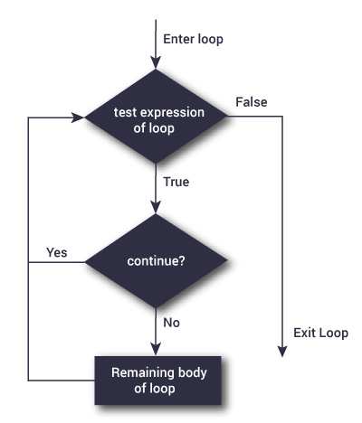

<h1>Table of Contents<span class="tocSkip"></span></h1>
<div class="toc"><ul class="toc-item"><li><span><a href="#if-statement" data-toc-modified-id="if-statement-1"><span class="toc-item-num">1&nbsp;&nbsp;</span><code>if</code> statement</a></span></li><li><span><a href="#while-statement" data-toc-modified-id="while-statement-2"><span class="toc-item-num">2&nbsp;&nbsp;</span><code>while</code> statement</a></span></li><li><span><a href="#for-statement" data-toc-modified-id="for-statement-3"><span class="toc-item-num">3&nbsp;&nbsp;</span><code>for</code> statement</a></span></li><li><span><a href="#break-statement" data-toc-modified-id="break-statement-4"><span class="toc-item-num">4&nbsp;&nbsp;</span><code>break</code> statement</a></span></li><li><span><a href="#continue-statement" data-toc-modified-id="continue-statement-5"><span class="toc-item-num">5&nbsp;&nbsp;</span><code>continue</code> statement</a></span></li></ul></div>

## `if` statement

`if` statement structure:

    1. 
``` python
if(expression):
    statement
```
    2. 
``` python
if(expression):
    statement
else:
    statement
```
    3. 
``` python
if(expression):
    statement
elif:
    statement
else:
    statement
```


```python
a=7
if a==7:
    print(a)
```

    7


```python
if a!=7:
    print(o)
```


```python
if a<5:
    print('less than 5')
else:
    print('greater than 5')
```

    greater than 5


```python
a=3
if 3<=a<4:
    print('Normal')
elif 4<=a<4.5:
    print('Good')
elif 4.5<=a<5:
    print('Excellent')
else:
    print('😭')
```

    Normal


## `while` statement

`while` statement structure:

    1.
``` python
while (expression):
    statement
    ..
```
    2. 
``` python
while (expression):
    statement
else:
    statement
```


```python
a=5
while a>0:
    print(a)
    a-=1
```

    5
    4
    3
    2
    1


```python
a=5
while a>0:
    print(a)
    a-=1
else:
    print('ok')
```

    5
    4
    3
    2
    1
    ok


```python
a=1
while a<10:
    if a<=5:
        print(a)
    else:
        print('Hello')
    a+=1
else:
    print('Done!')
```

    1
    2
    3
    4
    5
    Hello
    Hello
    Hello
    Hello
    Done!


## `for` statement

`for` statement structure:
    1.  
``` python
for i in <sequence>:
    statement
```
    2. 
``` python
for i in range(<range>):
    statement
```
    3.
``` python
for i in <some sequence or range>:
    statement
else:
    statement
```


```python
import math
for i in [1,2,4,8,16]:
    print(math.sqrt(i))
```

    1.0
    1.4142135623730951
    2.0
    2.8284271247461903
    4.0


```python
for i in range(3):
    print(i)
```

    0
    1
    2


```python
for i in range(4,9): #including 4 not including 9
    print(i)
```

    4
    5
    6
    7
    8


```python
for i in range(1,10):
    print(i)
else:
    print('Done')
```

    1
    2
    3
    4
    5
    6
    7
    8
    9
    Done


```python
for i in range(10):
    if i%2==0:
        print(i)
        print('i is an even nummber')
    else:
        print(i)
        print('i is an odd number')
```

    0
    i is an even nummber
    1
    i is an odd number
    2
    i is an even nummber
    3
    i is an odd number
    4
    i is an even nummber
    5
    i is an odd number
    6
    i is an even nummber
    7
    i is an odd number
    8
    i is an even nummber
    9
    i is an odd number


```python
for i in range(5):
    print('Now printing the {}th number!'.format(i))
```

    Now printing the 0th number!
    Now printing the 1th number!
    Now printing the 2th number!
    Now printing the 3th number!
    Now printing the 4th number!


## `break` statement

The break statement terminates the loop containing it.


```python
a = 1
while True:
    print(a)
    a+=1
    if a==10:
        break
```

    1
    2
    3
    4
    5
    6
    7
    8
    9


```python
for i in range(5,9):
    print(i)
    if i>7:
        break
```

    5
    6
    7
    8


```python
a=10
while a<=12:
    a+=1
    for i in range(1,7):
        print(i) 
        if i==5:
            break
```

    1
    2
    3
    4
    5
    1
    2
    3
    4
    5
    1
    2
    3
    4
    5


## `continue` statement

The continue statement is used to skip the rest of **the code inside a loop for the current iteration only**. Loop does not terminate but continues on with the next iteration.




```python
a=1
while a<7:
    a+=1
    print(a)
```

    2
    3
    4
    5
    6
    7


```python
a=1
while a<7:
    a+=1
    if a==3:
        continue
    print(a)
```

    2
    4
    5
    6
    7


```python
for i in range(1,7):
    if i==3:
        continue
    print(i)
```

    1
    2
    4
    5
    6


```python
for i in range(1,7):
    print(i)
    if i==3:
        continue
```

    1
    2
    3
    4
    5
    6


```python
a=1
while a<7:
    a+=1
    if a==4:
        continue
    for i in range(7,10):
        if i=='9':
            continue
        print(i)
```

    7
    8
    9
    7
    8
    9
    7
    8
    9
    7
    8
    9
    7
    8
    9


```python
for i in range(10,19):
    if i==15:
        continue
    print(i)
```

    10
    11
    12
    13
    14
    16
    17
    18


```python
for i in range(10,19):
    if i==15:
        break
    print(i)
```

    10
    11
    12
    13
    14


```python

```
